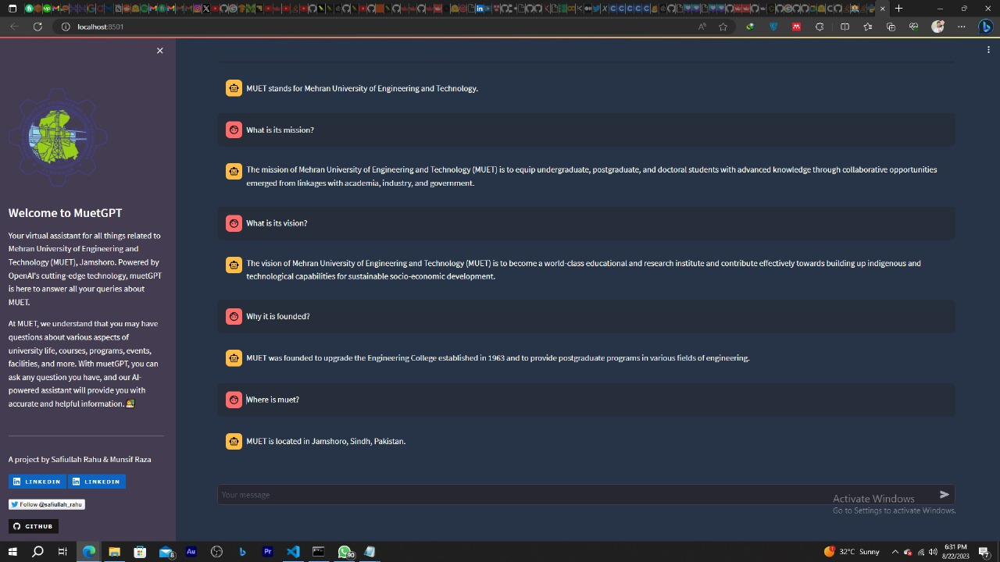

# MuetGPT 🎓

MuetGPT is an AI-powered chatbot designed to provide accurate and prompt responses to all your queries related to Mehran University of Engineering and Technology (MUET), Jamshoro. Built using Streamlit and powered by OpenAI's model, MuetGPT aims to make accessing MUET-related information convenient and efficient.

## Features

CSV-AI offers the following key features:

- **Instant Responses:** MuetGPT leverages the power of OpenAI's model to provide quick and accurate answers to your questions about MUET.
- **Wide Range of Queries:** Whether you're a student, faculty member, prospective student, or anyone curious about MUET, MuetGPT can help answer various queries, including information about courses, programs, admissions, events, facilities, and more.
- **Data-Driven Retrieval:** MuetGPT utilizes data from the official MUET website for retrieval-based responses, ensuring that the information provided is up-to-date and reliable.

## How It Works
MuetGPT uses a combination of natural language processing and data retrieval methods to respond to user queries. The chatbot processes your input, understands the context, and generates relevant and informative responses. The data from the official MUET website serves as a valuable source of information for retrieval-based responses.

## Getting Started

To run CSV-AI, follow these steps:

1. Clone this repository to your local machine.

```bash
git clone https://github.com/Safiullah-Rahu/muetgpt.git
```
2. Install the required dependencies.
```bash 
pip install -r requirements.txt
```
3. Replace your OpenAI GPT-3 API key in the secrets.toml file.
4. Run the Streamlit app.
```bash 
streamlit run app.py
```
This command will launch the MuetGPT app in your default web browser. 
5. Interact with MuetGPT by typing your queries and receiving instant responses related to MUET.



## Contributions and Improvements
MuetGPT is an open-source project, and contributions are welcome! If you'd like to add new features, improve the chatbot's responses, or enhance the user experience, feel free to submit pull requests.

## License
This project is licensed under the MIT License - see the LICENSE file for details.

---
## **A project by Safiullah Rahu & Munsif Raza**
[](https://www.linkedin.com/in/safiullahrahu/)
[](https://www.linkedin.com/in/munsifraza/)
[](https://www.twitter.com/safiullah_rahu)
[](https://github.com/Safiullah-Rahu)

Feel free to use, modify, and share MuetGPT to enhance the accessibility of MUET-related information. If you have any questions or suggestions, please feel free to reach out to us. Happy querying with MuetGPT!
